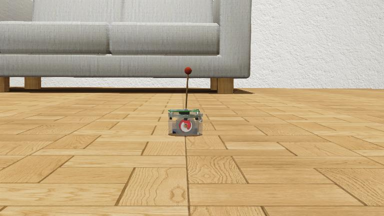

# Inverted Pendulum Benchmark

## Description
Program an e-puck robot to maintain an inverted pendulum up as long as possible.

  

## Information
- Difficulty: 3
- Robot: E-puck
- Language: Python
- Commitment: A couple of hours
